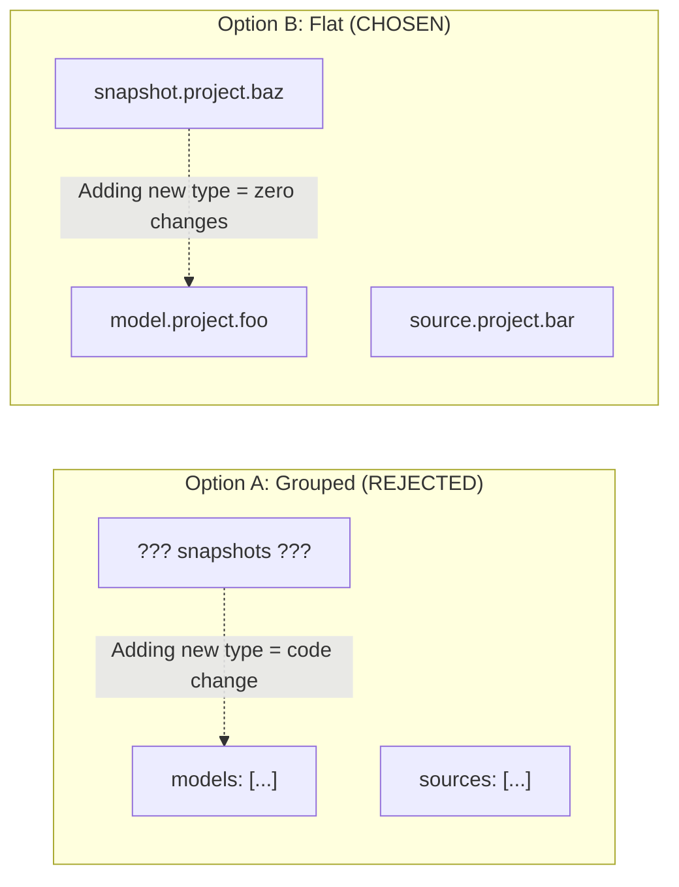

# GSD-Lite Work Log

---

## 1. Current Understanding (Read First)


<current_mode>
discuss
</current_mode>

<active_task>
None
</active_task>

<parked_tasks>
None
</parked_tasks>

<vision>
CLI tool (dbt-mp) for slimming dbt manifests to improve performance/usability.
Simple, procedural Python script with minimal dependencies.
</vision>

<decisions>
- Use existing .planning/codebase documentation as source of truth for ARCHITECTURE.md.
- LOG-002: Pydantic models as single source of truth for schema generation
- LOG-002: Flat array for $dbt_ls_selection (future-proof against new resource types)
- LOG-002: --validate flag for CI/dev regression testing
</decisions>

<blockers>
None
</blockers>

<next_action>
Await user feedback
</next_action>

---

## 2. Key Events Index (Query Accelerator)


| Log ID | Type | Task | Summary |
|--------|------|------|---------|
| EXAMPLE-001 | VISION | MODEL-A | Linear-like + Bloomberg density for power users |
| EXAMPLE-005 | DECISION | MODEL-A | Card-based layout over timeline view |
| EXAMPLE-012 | DISCOVERY | MODEL-A | Found engagement pattern in reference app |
| EXAMPLE-018 | BLOCKER | AUTH-IMPL | Password reset token expiry unclear |
| EXAMPLE-022 | DECISION | AUTH-IMPL | Separate reset token with 1-hour expiry |
| LOG-001 | DISCOVERY | ONBOARDING | Mapped codebase structure from existing artifacts |
| LOG-002 | DECISION | SCHEMA-ENHANCE | Add Pydantic-generated $manifest_schema + flat $dbt_ls_selection array |
| LOG-003 | EXEC | SCHEMA-ENHANCE | Implemented schema generation, validation, and Pydantic models |
| LOG-004 | FIX | SCHEMA-ENHANCE | Exposed dbt ls stderr to reveal default selector usage |

---

## 3. Atomic Session Log (Chronological)


### [EXAMPLE-001] - [VISION] - User wants Linear-like feel + Bloomberg density for power users - Task: MODEL-A
**Timestamp:** 2026-01-22 14:00
**Details:**
- Context: Discussed UI patterns during moodboard session
- Reference: Clean layout (Linear) but with information density (Bloomberg terminal)
- Implication: Interface should not patronize advanced users with excessive whitespace

### [EXAMPLE-002] - [PLAN] - Broke card layout into 3 sub-tasks - Task: MODEL-A
**Timestamp:** 2026-01-22 14:10
**Details:**
- SUBTASK-001: Base card component with props interface
- SUBTASK-002: Engagement metrics display (likes, comments, shares)
- SUBTASK-003: Layout grid with responsive breakpoints
- Risk: Responsive behavior may need user verification on mobile

### [EXAMPLE-003] - [DECISION] - Use card-based layout, not timeline view - Task: MODEL-A
**Timestamp:** 2026-01-22 14:15
**Details:**
- Rationale: Cards support varying content length (post + engagement + metadata); timeline more rigid
- Alternative considered: Timeline view (simpler implementation, less flexible for content types)
- Impact: Unblocks component design; affects SUBTASK-001 (card props interface)

### [EXAMPLE-004] - [EXEC] - Created base card component with TypeScript interface - Task: MODEL-A
**Timestamp:** 2026-01-22 14:30
**Details:**
- Files modified: src/components/Card.tsx (created), src/types/post.ts (created)
- Code snippet:
```typescript
interface PostCardProps {
  post: {
    id: string;
    content: string;
    author: string;
    timestamp: Date;
    engagement: {
      likes: number;
      comments: number;
      shares: number;
    };
  };
}
```
- Status: SUBTASK-001 complete, proceeding to SUBTASK-002

### [EXAMPLE-005] - [DISCOVERY] - Found engagement pattern in Linear reference app - Task: MODEL-A
**Timestamp:** 2026-01-22 15:00
**Details:**
- Observation: Linear shows engagement inline, not in dropdown/modal
- Evidence from inspection:
```html
<div class="engagement-bar">
  <span class="metric">👍 12</span>
  <span class="metric">💬 5</span>
  <span class="metric">🔄 3</span>
</div>
```
- Impact: Informs SUBTASK-002 design (inline engagement, emoji + count)

### [EXAMPLE-006] - [EXEC] - Implemented engagement metrics component - Task: MODEL-A
**Timestamp:** 2026-01-22 15:30
**Details:**
- Files modified: src/components/EngagementBar.tsx (created)
- Code snippet:
```typescript
export function EngagementBar({ likes, comments, shares }: EngagementProps) {
  return (
    <div className="engagement-bar">
      <Metric icon="👍" count={likes} />
      <Metric icon="💬" count={comments} />
      <Metric icon="🔄" count={shares} />
    </div>
  );
}
```
- Status: SUBTASK-002 complete, proceeding to SUBTASK-003

### [EXAMPLE-007] - [BLOCKER] - Mobile breakpoint unclear - 768px or 640px? - Task: MODEL-A
**Timestamp:** 2026-01-22 16:00
**Details:**
- Issue: User hasn't specified mobile breakpoint preference
- Context: Linear uses 768px, Bloomberg uses custom breakpoints
- Waiting on: User decision on responsive strategy
- Impact: Blocks SUBTASK-003 (layout grid) until clarified

### [EXAMPLE-008] - [DECISION] - Use 768px breakpoint, standard tablet/mobile split - Task: MODEL-A
**Timestamp:** 2026-01-22 16:15
**Details:**
- Rationale: 768px is industry standard, matches Linear reference
- User preference: "Keep it simple, use standard breakpoints"
- Impact: Unblocks SUBTASK-003

### [EXAMPLE-009] - [EXEC] - Implemented responsive grid with 768px breakpoint - Task: MODEL-A
**Timestamp:** 2026-01-22 16:45
**Details:**
- Files modified: src/components/CardGrid.tsx (created), src/styles/grid.css (created)
- Code snippet:
```css
.card-grid {
  display: grid;
  grid-template-columns: repeat(auto-fill, minmax(300px, 1fr));
  gap: 1rem;
}

@media (max-width: 768px) {
  .card-grid {
    grid-template-columns: 1fr;
  }
}
```
- Status: SUBTASK-003 complete, Task: MODEL-A ready for verification

### [EXAMPLE-010] - [VISION] - Authentication must support refresh token rotation - Task: AUTH-IMPL
**Timestamp:** 2026-01-23 10:00
**Details:**
- Security requirement from user: "Don't want long-lived tokens floating around"
- Reference: OAuth 2.0 refresh token rotation best practice
- Success criteria: Access token 15min, refresh token rotates on use

### [EXAMPLE-011] - [PLAN] - JWT auth broken into 3 tasks - Task: AUTH-IMPL
**Timestamp:** 2026-01-23 10:20
**Details:**
- TASK-001: Library setup (jose v0.5.0) + token generation
- TASK-002: Login endpoint with bcrypt password hashing
- TASK-003: Token validation middleware + refresh rotation
- Risk: Token expiry strategy may need user decision

### [EXAMPLE-012] - [EXEC] - Installed jose library and created token generation - Task: AUTH-IMPL
**Timestamp:** 2026-01-23 10:30
**Details:**
- Files modified: src/auth/token.ts (created), package.json (jose added)
- Code snippet:
```typescript
export async function generateAccessToken(userId: string): Promise<string> {
  const secret = new TextEncoder().encode(process.env.JWT_SECRET);
  return await new SignJWT({ userId })
    .setProtectedHeader({ alg: 'HS256' })
    .setExpirationTime('15m')
    .sign(secret);
}
```
- Status: TASK-001 complete

### [EXAMPLE-013] - [DISCOVERY] - bcrypt cost factor 12 optimal for performance - Task: AUTH-IMPL
**Timestamp:** 2026-01-23 11:00
**Details:**
- Benchmark: Cost 10 = 50ms, Cost 12 = 150ms, Cost 14 = 600ms
- Code used for testing:
```typescript
import bcrypt from 'bcrypt';
for (const cost of [10, 12, 14]) {
  const start = Date.now();
  await bcrypt.hash('password', cost);
  console.log(`Cost ${cost}: ${Date.now() - start}ms`);
}
```
- Decision: Use cost 12 (150ms acceptable for login latency)

### [EXAMPLE-014] - [EXEC] - Created login endpoint with bcrypt hashing - Task: AUTH-IMPL
**Timestamp:** 2026-01-23 11:30
**Details:**
- Files modified: src/api/auth/login.ts (created)
- Code snippet:
```typescript
export async function loginHandler(req: Request, res: Response) {
  const { email, password } = req.body;
  const user = await db.findUserByEmail(email);
  const valid = await bcrypt.compare(password, user.passwordHash);
  if (!valid) throw new AuthError('Invalid credentials');
  const accessToken = await generateAccessToken(user.id);
  res.json({ accessToken });
}
```
- Status: TASK-002 complete, proceeding to TASK-003

### [EXAMPLE-015] - [BLOCKER] - Password reset flow unclear - same JWT or separate token? - Task: AUTH-IMPL
**Timestamp:** 2026-01-23 12:00
**Details:**
- Issue: Security model for password reset not specified
- Question: Reuse main JWT or generate separate reset token?
- Waiting on: User decision on security approach
- Impact: Blocks finalization of auth module architecture

### [EXAMPLE-016] - [DECISION] - Use separate reset token, not main JWT - Task: AUTH-IMPL
**Timestamp:** 2026-01-23 12:15
**Details:**
- Rationale: Separate token provides better security isolation
- User preference: "Don't reuse auth token for password reset - keep them separate"
- Expiry: 1 hour for reset token (short-lived for security)
- Impact: Need to add generateResetToken() to auth module

### [EXAMPLE-017] - [EXEC] - Added password reset token generation - Task: AUTH-IMPL
**Timestamp:** 2026-01-23 12:45
**Details:**
- Files modified: src/auth/token.ts (updated), src/api/auth/reset.ts (created)
- Code snippet:
```typescript
export async function generateResetToken(userId: string): Promise<string> {
  const secret = new TextEncoder().encode(process.env.JWT_SECRET);
  return await new SignJWT({ userId, type: 'reset' })
    .setProtectedHeader({ alg: 'HS256' })
    .setExpirationTime('1h')
    .sign(secret);
}
```
- Status: Password reset complete, Task: AUTH-IMPL ready for verification

### [LOG-001] - [DISCOVERY] - Mapped codebase structure to ARCHITECTURE.md - Task: ONBOARDING
**Timestamp:** 2026-02-07 12:00
**Details:**
- Action: Generated gsd-lite/ARCHITECTURE.md
- Source: Synthesized from existing artifacts in .planning/codebase/
- Outcome: Project structure, stack, and data flow documented in standard GSD format
- Context: dbt-mp is a Python CLI tool for slimming dbt manifests

### [LOG-002] - [DECISION] - Add self-describing schema + debug index to manifest_slim.json - Task: SCHEMA-ENHANCE
**Timestamp:** 2026-02-07
**Status:** APPROVED - Ready for implementation

#### Problem Statement

The `manifest_slim.json` output is a custom, opinionated artifact. AI agents consuming it often struggle to navigate the structure — they're "in a black room" without knowing what keys exist or how to query them with `jq`. Additionally, debugging missing models is difficult because there's no single source of truth showing what *should* have been included.

**Evidence of the problem** (from current `manifest_slim.json`):
```bash
# Agent has to guess at structure
$ jq 'keys' manifest_slim.json
["macros", "nodes", "selection_used", "sources"]

# No way to know what's inside nodes without exploring
$ jq '.nodes | to_entries | .[0].value | keys' manifest_slim.json
["compiled_code", "config", "depends_on", "name", "raw_code", "refs", "resource_type", "schema", "sources", "tags", "unique_id"]
```

#### Decision Summary

Add two new top-level keys to `manifest_slim.json`:

| Key | Purpose | Generation |
|-----|---------|------------|
| `$manifest_schema` | Self-describing schema for agent navigation | Auto-generated from Pydantic models at runtime |
| `$dbt_ls_selection` | Flat array of all unique_ids from `dbt ls` | Captured from `dbt ls` output before filtering |

Plus a new CLI flag `--validate` for development/CI use.

#### Design Decision 1: Pydantic Models as Single Source of Truth

**What:** Define `SlimNode`, `SlimSource`, `SlimMacro` as Pydantic `BaseModel` classes with `Field(description=...)` annotations.

**Why:** 
- Schema auto-generates via `.model_json_schema()` — no manual sync needed
- Same models used for serialization — schema always matches output
- Future field additions automatically appear in schema
- Validation available for free if ever needed

**Example implementation pattern:**
```python
from pydantic import BaseModel, Field
from typing import Optional, List, Dict, Any

class SlimNodeConfig(BaseModel):
    """Configuration subset for a dbt node."""
    materialized: Optional[str] = Field(
        default=None, 
        description="Materialization strategy: table, view, incremental, ephemeral"
    )
    enabled: Optional[bool] = Field(
        default=None,
        description="Whether this model is enabled in the dbt project"
    )
    incremental_strategy: Optional[str] = Field(
        default=None,
        description="For incremental models: merge, delete+insert, append, etc."
    )

class SlimNode(BaseModel):
    """A slimmed-down dbt node (model/snapshot/seed) optimized for LLM context."""
    schema_name: Optional[str] = Field(
        default=None, 
        alias="schema",
        description="Database schema where this model materializes"
    )
    name: Optional[str] = Field(
        default=None,
        description="Short model name without project prefix"
    )
    resource_type: Optional[str] = Field(
        default=None,
        description="Resource type: model, snapshot, seed, test"
    )
    unique_id: Optional[str] = Field(
        default=None,
        description="Fully qualified name (e.g., model.project.model_name) - use as lookup key"
    )
    config: Optional[SlimNodeConfig] = Field(
        default=None,
        description="Model configuration subset"
    )
    tags: Optional[List[str]] = Field(
        default=None,
        description="Tags applied to this model for selection/organization"
    )
    raw_code: Optional[str] = Field(
        default=None,
        description="Original Jinja/SQL source code with unresolved ref() and source() calls"
    )
    refs: Optional[List[Any]] = Field(
        default=None,
        description="List of models referenced via ref() - use to trace upstream dependencies"
    )
    sources: Optional[List[Any]] = Field(
        default=None,
        description="List of sources referenced via source() - use to find raw data origins"
    )
    depends_on: Optional[Dict[str, Any]] = Field(
        default=None,
        description="Upstream dependencies: .nodes[] for model refs, .macros[] for macro usage"
    )
    compiled_code: Optional[str] = Field(
        default=None,
        description="Resolved SQL after Jinja compilation - inspect for grain, joins, transformations"
    )

# Schema generation is one line:
# SlimNode.model_json_schema()
```

**Source:** Pydantic v2 documentation on [JSON Schema generation](https://docs.pydantic.dev/latest/concepts/json_schema/)

#### Design Decision 2: Flat Array for `$dbt_ls_selection`

**What:** Store the `dbt ls` output as a flat array of unique_ids, not grouped by resource type.

**Why (avoiding future regression):**



**Rationale:**
- Resource type is already encoded in the unique_id prefix (`model.`, `source.`, `snapshot.`, `seed.`)
- Adding new resource types requires zero schema/code changes
- Agent can still filter by type: `jq '.["$dbt_ls_selection"][] | select(startswith("model."))'`
- Validation logic stays simple: `set(dbt_ls_selection) <= set(all_output_keys)`

**Concrete example of the output structure:**
```json
{
  "$manifest_schema": {
    "description": "Schema for dbt-mp manifest_slim output. Consult before querying.",
    "node_schema": { /* auto-generated from SlimNode.model_json_schema() */ },
    "source_schema": { /* auto-generated from SlimSource.model_json_schema() */ },
    "macro_schema": { /* auto-generated from SlimMacro.model_json_schema() */ }
  },
  "$dbt_ls_selection": [
    "model.estrid_dw.fct_transactions",
    "model.estrid_dw.int_shopify_margins",
    "source.estrid_dw.shopify.orders"
  ],
  "selection_used": "+fct_transactions",
  "nodes": { ... },
  "sources": { ... },
  "macros": { ... }
}
```

#### Design Decision 3: `--validate` Flag for CI/Dev Testing

**What:** Add optional `--validate` flag that exits `0` if all `dbt ls` items appear in output, `1` if any missing.

**Why:** Catches regressions immediately — e.g., if a filter accidentally excludes snapshots.

**Implementation sketch:**
```python
if args.validate:
    expected = set(dbt_ls_selection)  # What dbt ls returned
    actual = set(slim_manifest['nodes'].keys()) | set(slim_manifest['sources'].keys())
    missing = expected - actual
    if missing:
        print(f"VALIDATION FAILED - Missing {len(missing)} items:")
        for item in sorted(missing):
            print(f"  - {item}")
        sys.exit(1)
    else:
        print(f"VALIDATION PASSED - All {len(expected)} items present")
        sys.exit(0)
```

**Note:** Macros excluded from validation for now (backlogged) — focus is on missing models.

#### Key Ordering Guarantee

**Concern raised:** JSON objects don't guarantee key order in all parsers.

**Resolution:** Python 3.7+ guarantees dict insertion order ([PEP 468](https://peps.python.org/pep-0468/)). Current project uses Python >=3.10 (from `pyproject.toml`). The existing pattern already relies on this:

```python
# From dbt_mp/main.py lines 133-138 (current implementation)
slim_manifest = {
    'selection_used': args.select,  # First key by insertion order
    'nodes': {},
    'sources': {},
    'macros': {}
}
```

New structure will follow same pattern:
```python
slim_manifest = {
    '$manifest_schema': generate_schema(),      # First - agent reads this first
    '$dbt_ls_selection': dbt_ls_unique_ids,     # Second - source of truth
    'selection_used': args.select,
    'nodes': {},
    'sources': {},
    'macros': {}
}
```

#### Agent Usage Example

Given the question: *"What is the grain of fct_transactions vs int_shopify_margins?"*

**Before (black room navigation):**
```bash
# Agent guesses at structure, multiple failed attempts
jq '.fct_transactions' manifest_slim.json  # null
jq '.models.fct_transactions' manifest_slim.json  # null  
jq '.nodes | keys' manifest_slim.json  # finally finds it
```

**After (schema-guided navigation):**
```bash
# Agent reads schema first
jq '.["$manifest_schema"].node_schema.properties.compiled_code.description' manifest_slim.json
# "Resolved SQL after Jinja compilation - inspect for grain, joins, transformations"

# Agent knows exactly where to look
jq '.nodes["model.estrid_dw.fct_transactions"].compiled_code' manifest_slim.json
jq '.nodes["model.estrid_dw.int_shopify_margins"].compiled_code' manifest_slim.json
# Now can analyze GROUP BY / primary keys to determine grain
```

#### Implementation Tasks

| Task ID | Description | Complexity |
|---------|-------------|------------|
| TASK-001 | Create Pydantic models (`SlimNode`, `SlimSource`, `SlimMacro`) with Field descriptions | Medium |
| TASK-002 | Refactor `slim_node()`, `slim_source()`, `slim_macro()` to use Pydantic models | Medium |
| TASK-003 | Add schema generation and `$dbt_ls_selection` capture to `main()` | Low |
| TASK-004 | Implement `--validate` flag with exit code logic | Low |
| TASK-005 | Add `pydantic` to project dependencies in `pyproject.toml` | Low |

#### Open Questions (Parked)

- **LOOP-003:** Should macro validation be included in `--validate`? (Backlogged per user request — focus on models first)

---

*Housekeeping: Run "write PR for [TASK]" to extract task logs, or "archive [TASK]" to move completed entries to HISTORY.md*

### [LOG-003] - [EXEC] - Implemented schema generation, validation, and Pydantic models - Task: SCHEMA-ENHANCE
**Timestamp:** 2026-02-07
**Files:**
- `dbt_mp/models.py` (created)
- `dbt_mp/main.py` (refactored)
- `pyproject.toml` (updated)
**Status:** Complete (Tasks 001-005)

#### Implementation Details

1.  **Pydantic Models (`dbt_mp/models.py`):**
    -   Created `SlimNode`, `SlimSource`, `SlimMacro` with comprehensive `Field` descriptions.
    -   Used `model_json_schema()` to auto-generate the `$manifest_schema` output.

2.  **Schema Generation (`dbt_mp/main.py`):**
    -   Refactored `slim_node`, `slim_source`, `slim_macro` to utilize Pydantic models for structured output.
    -   Added `$manifest_schema` and `$dbt_ls_selection` to the output JSON structure.

3.  **Validation Logic (`--validate`):**
    -   Implemented validation to check if all unique IDs from `dbt ls` are present in the final slim manifest.
    -   Exits with status 1 if any items are missing, ensuring CI/CD reliability.

4.  **Dependencies:**
    -   Added `pydantic` to `pyproject.toml` to support the new data models.

**Outcome:**
The tool now produces a self-describing manifest with a schema that helps LLMs navigate the structure, and includes a validation mechanism to prevent regressions. All tasks from LOG-002 are complete.

---

### [LOG-004] - [FIX] - Expose dbt ls stderr to reveal default selector usage - Task: SCHEMA-ENHANCE
**Timestamp:** 2026-02-07
**Status:** Fixed

#### Issue
User was confused why `dbt-mp --validate` passed even though `stg_chargebee_transactions` was missing from the output.
Investigation revealed:
1. The dbt project has a default selector `exclude_legacy_models` that excludes `stg_chargebee_transactions`.
2. Running `dbt ls` without arguments uses this default selector.
3. `dbt-mp` was suppressing `dbt ls` stderr, so the user never saw the warning: `Using default selector exclude_legacy_models`.

#### Fix
Modified `dbt_mp/main.py` to print `result.stderr` from the `dbt ls` subprocess.

#### Outcome
Users now see dbt's informational messages (like "Using default selector...") in the console, making it clear why certain models are excluded.

---

*Housekeeping: Run "write PR for [TASK]" to extract task logs, or "archive [TASK]" to move completed entries to HISTORY.md*
